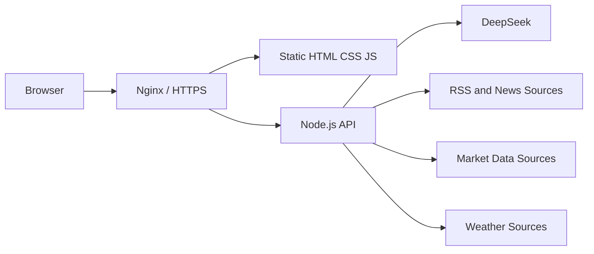

# CHEY Intelligence Brief

一个面向个人决策的实时情报简报页面，聚合 AI 动态、国内热点、国际局势、模型榜单、天气和金融市场数据，并使用 AI 完成翻译、摘要与重点分析。

**在线访问：** [https://brief.0cy.top](https://brief.0cy.top)

## 功能概览

- **AI Daily Brief**：聚合 AI 模型、产品和行业动态。
- **Domestic News Top 10**：侧重社会要闻、民生、金融经济、科技发展与机会观察。
- **Global Intelligence**：RSS 真实新闻源、中文翻译、AI 局势分析和“我的关注”。
- **LM Arena Top 10**：Code、Chat、Image、Video 多榜单切换。
- **Weather**：成都实时天气、未来三日及分时段预报。
- **Financial Markets**：中国市场、美国市场、黄金、原油及日 K 趋势。
- **数据时间戳**：区分新闻发布时间、抓取时间和市场实际行情时间。
- **响应式界面**：适配桌面与移动设备，支持深色/浅色主题。

## 技术架构



- 前端：原生 HTML、CSS、JavaScript，无构建步骤。
- 后端：Node.js、Express、CORS、dotenv。
- 部署：Nginx 反向代理、systemd、Let's Encrypt HTTPS。
- 缓存：浏览器本地缓存与后端运行时缓存。

## 项目结构

```text
.
├── ai-morning-brief.html       # 页面结构
├── styles.css                  # 全局与响应式样式
├── js/
│   ├── effects.js              # 粒子背景、动态标题等视觉效果
│   ├── domestic-news.js        # 国内热点渲染与时间戳
│   ├── core.js                 # 缓存、主题、快照与通用工具
│   ├── arena.js                # LM Arena 数据和榜单
│   ├── world.js                # 国际新闻、翻译、分析与我的关注
│   ├── finance.js              # 金融分析与补充行情
│   └── data.js                 # 数据加载、刷新、天气和主行情
├── llm-server.js               # 生产 API 服务
├── local-preview-server.js     # 本地静态预览与 API 代理
├── tests/
│   ├── static-integrity.js     # 静态结构与安全检查
│   └── smoke.js                # 新闻、行情和公开文件冒烟测试
├── .env.example                # 环境变量模板，不含真实密钥
├── package.json
├── package-lock.json
└── DEPLOYMENT.md               # 详细部署说明
```

## 环境要求

- Node.js 18 或更高版本，生产环境推荐 Node.js 22 LTS。
- npm 9 或更高版本。
- 生产部署需要 Nginx；HTTPS 推荐使用 Let's Encrypt。

## 快速预览

```powershell
npm ci
node local-preview-server.js
```

浏览器访问：

```text
http://127.0.0.1:8080/
```

本地预览服务器会提供静态文件，并将需要 AI 能力的请求代理至正式服务。可通过以下变量修改预览端口和上游地址：

```powershell
$env:PREVIEW_PORT = "8080"
$env:LIVE_ORIGIN = "https://brief.0cy.top"
node local-preview-server.js
```

## 后端配置

复制环境变量模板：

```powershell
Copy-Item .env.example .env
```

至少需要配置：

```dotenv
DEEPSEEK_API_KEY=your-api-key
```

天气实时数据可选配置：

```dotenv
SENIVERSE_KEYS=your-uid:your-key
```

启动后端：

```powershell
npm start
```

后端仅监听 `127.0.0.1:3000`。生产环境应由 Nginx 将 `/api/llm/` 反向代理至该服务，不要直接开放 3000 端口。

## 测试

```powershell
npm test
npm run test:smoke
```

- `npm test`：检查脚本语法、DOM ID、模块引用、敏感文件规则和关键回归项。
- `npm run test:smoke`：启动隔离的临时预览服务，验证公开资源、敏感文件阻断、新闻和市场接口。

## 安全说明

- 不要提交 `.env`、PEM/KEY 私钥、日志、运行时缓存或备份目录。
- API Key 仅存放在服务器后端 `.env`，不得写入前端脚本。
- 生产服务使用 Origin 白名单、请求体限制、RSS 域名白名单和每日调用限制。
- Nginx 应阻止 `.env`、`.pem`、`.key`、日志和备份文件的公开访问。
- 新闻摘要和市场分析仅供信息参考，不构成投资建议。

更完整的服务器配置、Nginx 和 systemd 说明见 [DEPLOYMENT.md](DEPLOYMENT.md)。

